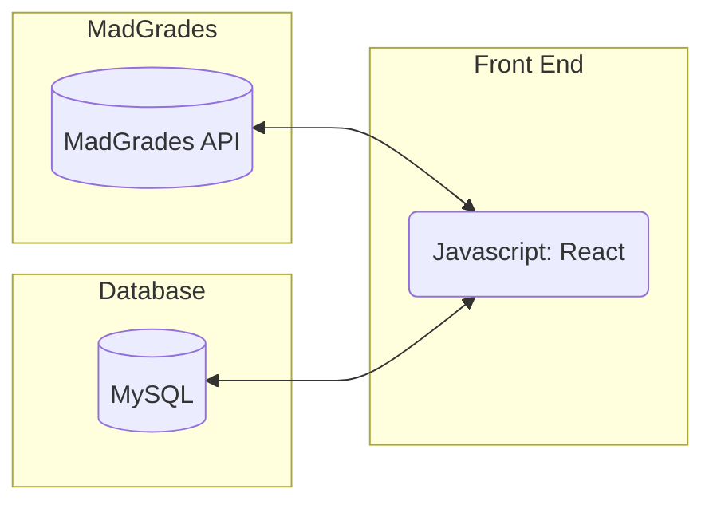
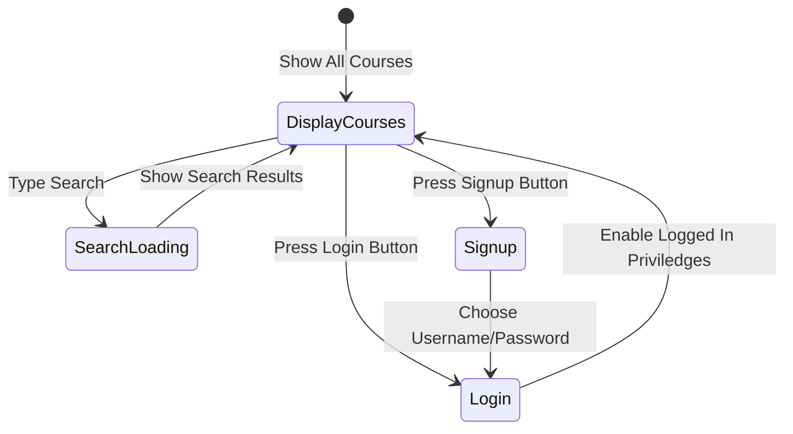
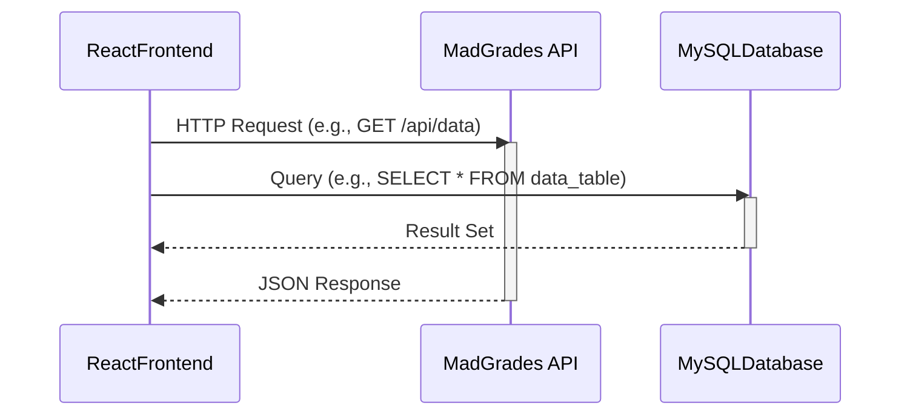

# Specification Document

## TeamName

<!--The name of your team.-->
Team Table 15

### Project Abstract

<!--A one paragraph summary of what the software will do.-->

The software that we are creating throughout this project will fetch and display UW-Madison course data and display it to users through a website. The data used for this website will be primarily retrieved from the MadGrades API to share reliable and up to date grade information about UW-Madison courses. It will also enable users to easily access this data through multiple search functionilties. 

### How to Access App in CS VM
Pull latest Image from GitLab CICD Release stage:
docker image pull registry.doit.wisc.edu/cdis/cs/courses/cs506/sp2025/team/t_15/project_15/frontend
Run the image in the t15 network and expose port 9090
docker run --network t15_default -p 9090:9090 -p 5657:5657 -d registry.doit.wisc.edu/cdis/cs/courses/cs506/sp2025/team/t_15/project_15/frontend:latest
The previous command should return a container id.  Execute this container with the id
docker exec -it CONTAINER_ID sh
exit
Log the return of the container running the app to make sure that the app is running and is able to connect to the database running on the VM
docker logs CONTAINER ID
Open a new terminal and create a ssh tunnel to port 9090 to check the app on your local machine
ssh -L 9090:localhost:9090  CSLOGIN@cs506x15.cs.wisc.edu
Try to hit port 9090 on your local machine:
http://localhost:9090/

### Customer

<!--A brief description of the customer for this software, both in general (the population who might eventually use such a system) and specifically for this document (the customer(s) who informed this document). Every project will have a customer from the CS506 instructional staff. Requirements should not be derived simply from discussion among team members. Ideally your customer should not only talk to you about requirements but also be excited later in the semester to use the system.-->

The customers we are targeting with our software are University of Wisconsin - Madion students. The website we are building will allow students, when looking for different classes to potentially enroll in, to easily search though courses and access data on the grades earned by students taking the course in past semesters. We aim to help simplify the process of course selection for these university students through this software.

### Specification

<!--A detailed specification of the system. UML, or other diagrams, such as finite automata, or other appropriate specification formalisms, are encouraged over natural language.-->

<!--Include sections, for example, illustrating the database architecture (with, for example, an ERD).-->

<!--Included below are some sample diagrams, including some example tech stack diagrams.-->

#### Technology Stack

#### Database

#### Class Diagram

#### Flowchart

#### Behavior

#### Sequence Diagram

### Standards & Conventions

<!--This is a link to a seperate coding conventions document / style guide-->
[Style Guide & Conventions](STYLE.md)