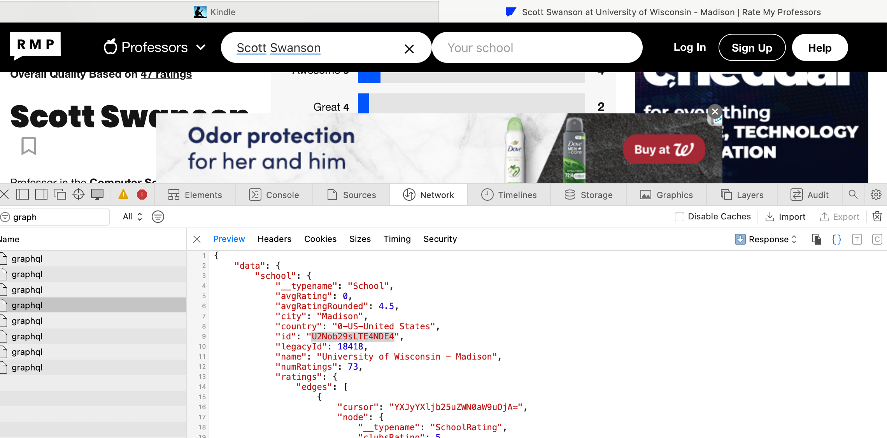

# Research Report
## Getting Rate My Prof Data
### Summary of Work
I researched different web scrapers and APIs that would be able to pull data from Rate My Professor to include in course grade data.  

### Motivation

Our team is considering adding Rate My Professor data to our webpage in addition to grade average data output.  To do this, however, we must find out how to effiecently source this data which is what I research here.

### Time Spent
5 minutes spent downloading @mtucourses/rate-my-professors npm package
10 minutes installing yarn and executing yarn commands
40 minutes setting up webpack.config.js to get npm import to work
30 minutes looking through @mtucourses/rate-my-professors api calls and executing them with test data from Michican Tech University
80 minutes finding data for UW-Madison school ID and department IDs by using dev tools to inspect graphql calls when searching for professors on the Rate My Professor website and getting correct returns.

### Results

The first thing I did was I searched for "rate my professor APIs" and "rate my professor data scrapers" on Google.  I came across a couple of Python data scrappers, but ignored them since our team chose to program our product in Java and Javascript.  I then cam accross an npm package for an API wrapper that would wrap around Rate My Professor's graphQL calls.[^1]  I downloaded this package to a new branch in the repo and started following the starter code given in the README of the npm package's git repo.[^2]

After adding the starter code, I needed to install Yarn so I could run the suggested Yarn commands to install the dependencies needed in the module so I followed a yarn install tutorial.[^3]

I needed a webpack config file to run my test code so I followed a webpack config tutorial to create a new js file.[^5]

I then went back to the npm package's git repo to understand the download's functions and what data I could pull back from Rate My Professor with it.[^2]  After getting the test code to work with Michigan Technological University data, I began experimenting with trying to get back UW-Madison specific data.

Here lies the problem: to search for data on different professors within this npm module, you need both a professor name AND the school ID Rate My Professor assigns to the school.  There is no document or public webpage that lists the ID for each university in Rate My Professors records, and so to get this ID to filter searches to be UW-Madison specific, I had to get a little creative.

I opened up the dev tools on my laptop and then navigated to the Rate My Profrssor webpage.[^4]  I then searched for "Scott Swanson" in "UW-Madison" on the webpage.  After completing my search, I went into to the Networking section of dev tools and filtered the network calls to "graphql" calls.  After that, I browsed through the different graphql call previews until I found one that contained the correct school ID for UW-Madison.

After capturing this ID, I was able to successfully return data on UW-Madison professor when searching for their name with the school ID.  This concluded my investigation on how to retrieve data from Rate My Professor.

### Sources
- @mtucourses/rate-my-professors npm package[^1]
- @mtucourses/rate-my-professors git lab repo[^2]
- Yarn Installer[^3]
- Rate My Professor[^4]
- Webpack Config[^5]

[^1]: https://www.npmjs.com/package/@mtucourses/rate-my-professors
[^2]: https://github.com/Michigan-Tech-Courses/rate-my-professors
[^3]: https://classic.yarnpkg.com/lang/en/docs/install/#mac-stable
[^4]: https://www.ratemyprofessors.com/
[^5]: https://webpack.js.org/guides/getting-started/
