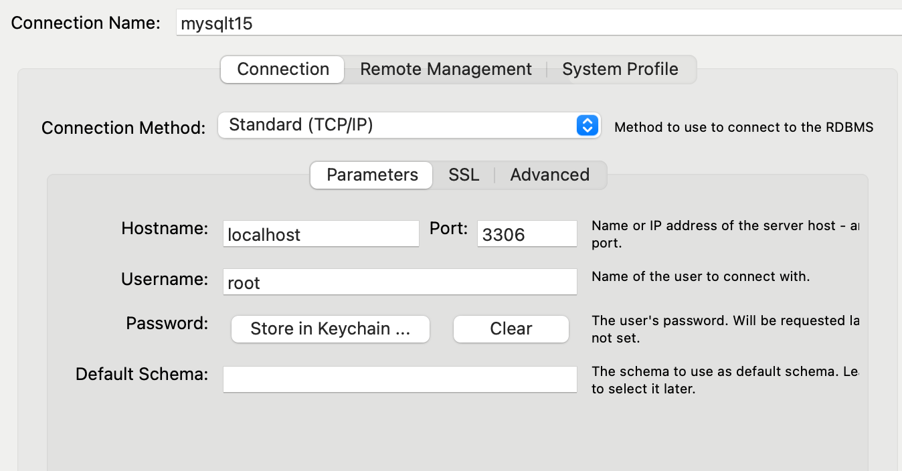

1.  made docker compose file: compose.yml
2.  ran script to compose 2 containers (1 for mysql and 1 for phpadmin): docker container exec -it e698f329c455 mysql -u root -p 
3.  open new terminal on local and run ssh tunnel:  ssh -L 3306:localhost:3306 CSLOGIN@cs506x15.cs.wisc.edu 
4.  open new connection in mysql workbench and connect to mysqlt15 (passowrd: shoelace)

5.  create tables
6.  in virtual machine run: mysql -h localhost -P 3306 --protocol=TCP -u root -p 
7.  check to make sure tables and changes are reflected in virtual machine mysql container

user_login mysql (has not null, unique, and auto-incremented primary key, unique and not null username, and not null password ):
create user_login table

CREATE TABLE `t15`.`user_login` (
  `iduser_login` INT NOT NULL AUTO_INCREMENT,
  `user_name` VARCHAR(45) NOT NULL,
  `password` VARCHAR(45) NOT NULL,
  PRIMARY KEY (`iduser_login`),
  UNIQUE INDEX `user_name_UNIQUE` (`user_name` ASC) VISIBLE,
  UNIQUE INDEX `iduser_login_UNIQUE` (`iduser_login` ASC) VISIBLE);
